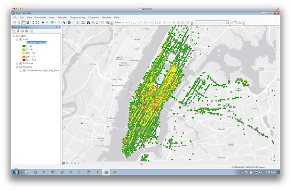

# Spark, Cassandra, Tessellation and ArcGIS

[Spark](http://spark.apache.org/) based project to tessellate and aggregate a set of coinciding locations on a hexagonal mosaic.

### Overview

In most cases, visualizing millions and millions of points is impractical, and patterns cannot be discerned from points stacked on top of each other on a map.  However, if the coinciding points are aggregated together based on some spatial criteria, then rendering the aggregation in that spatial criteria will reveal life patterns.

The below snapshot is such a life pattern. It represents the frequency of taxi pickups by locations in Manhattan between 7AM and 9AM.



The data is based on the first one million records of the [NYC taxi trips](http://chriswhong.com/) in the [data](data/trips-1M.csv.7z) folder.

This [Spark](http://spark.apache.org) job reads the trip data from the CSV file and reduces it by tessellating coinciding pickup locations.
The result is stored in [Cassandra](http://cassandra.apache.org/) using the [Spark to Cassandra connector](https://github.com/datastax/spark-cassandra-connector).
To visualize the result, [ArcMap](http://www.esri.com/software/arcgis/arcgis-for-desktop) is extended with an [ArcPy](http://help.arcgis.com/en/arcgisdesktop/10.0/help/index.html#/What_is_ArcPy/000v000000v7000000/) based [toolbox](http://help.arcgis.com/en/arcgisdesktop/10.0/help/index.html#/Creating_a_toolbox/003q00000010000000/) to connect to [Cassandra](https://github.com/datastax/python-driver) and display the table rows as features on the map.

### Dependencies

* [Cassandra](http://wiki.apache.org/cassandra/GettingStarted) - If you are on OSX, then follow [these](http://christopher-batey.blogspot.com/2013/05/installing-cassandra-on-mac-os-x.html) instructions.
* [My Web Mercator library](https://github.com/mraad/WebMercator)
* [My Hex Grid library](https://github.com/mraad/hex-grid)

### Setup

Once Cassandra is up and running, using a CQLSH session do the following:

```sql
CREATE KEYSPACE IF NOT EXISTS test
WITH REPLICATION = {'class': 'SimpleStrategy', 'replication_factor': 1 };

DROP TABLE IF EXISTS test.hexgrid;

CREATE TABLE IF NOT EXISTS test.hexgrid (
row bigint,
col bigint,
population int,
PRIMARY KEY (row,col)
);
```

The ArcPy toolbox depends on the [Cassandra python driver](https://github.com/datastax/python-driver). Use [pip](https://pip.pypa.io/en/latest/) to install it as **Administrator**:

```shell
pip install cassandra-driver
```

### Building

Before building this project, clone and install the [WebMercator](https://github.com/mraad/WebMercator) and [HexGrid](https://github.com/mraad/hex-grid) libraries.

Uncompress the [CVS file](data/trips-1M.csv.7z) in the data folder into your own folder.

This project uses [SBT](http://www.scala-sbt.org/) to compile it and package it into an executable form.

```
sbt package
```

### Running

```
sbt "run <csv-file-location> <cassandra-host>"
```

To view the result, use *cqlsh*:

```sql
cqlsh> select * from test.hexgrid limit 20;

 row  | col | population
------+-----+------------
 1235 | 385 |          7
 1235 | 386 |         42
 1235 | 387 |          1
 1235 | 389 |          4
 1235 | 394 |          8
 1235 | 396 |          1
 1235 | 398 |          7
 1235 | 399 |          1
 1235 | 408 |          1
 1235 | 420 |          1
 1240 | 389 |         19
 1240 | 390 |          1
 1240 | 392 |          2
 1240 | 397 |          2
 1240 | 399 |          2
 1240 | 401 |          2
 1240 | 415 |          1
 1240 | 416 |          3
 1240 | 436 |          1
 1240 | 437 |          1
```

### Viewing in ArcGIS for Desktop

Note that only the row and column values of the hex cell are stored in Cassandra. I'm taking advantage of something I call 'cooperative processing', where I let the server send a minimum set of data (in this case a set of row,col,population tuples) and let the client render that information as a polygon.
The polygon generation is done using the `Hex` class in `hex.py` and the hex placement on the map is performed by the `HexGrid` class in `hexgrid.py`.
When the `execute` function in `HexTripsToolbox` is invoked, it creates an in-memory feature class, then connects to Cassandra to fetch the content of the `test.hexgrid` table.
Each fetched row is converted into a hexagon shaped feature and appended to the in-memory feature class. At the end of iteration, the derived feature class is rendered on the map.

```python
def execute(self, parameters, messages):

    hex = Hex(size=100)
    hexgrid = HexGrid(size=100, origx=-8300000.0, origy=4800000.0)

    fc = "in_memory/cells"
    if arcpy.Exists(fc):
        arcpy.management.Delete(fc)

    spref = arcpy.SpatialReference(102100)
    arcpy.management.CreateFeatureclass("in_memory", "cells", "POLYGON", spatial_reference=spref)
    arcpy.management.AddField(fc, "POPULATION", "LONG")

    cursor = arcpy.da.InsertCursor(fc, ['SHAPE@', 'POPULATION'])
    try:
        cluster = Cluster(['192.168.172.1'], port=9042)
        session = cluster.connect('test')
        crows = session.execute('select * from hexgrid')
        for crow in crows:
            xy = hexgrid.rc2xy(crow.row, crow.col)
            cursor.insertRow([hex.toPolygon(xy[0], xy[1]), crow.population])
        del crows
    except:
        arcpy.AddError(traceback.format_exc())

    del cursor
    parameters[0].value = fc
    return
```
